# Scalable-AWS-Cloud-Architecture
This project demonstrates a highly available, scalable, and secure cloud architecture built on AWS for hosting a pharmacy web application.

 🏗️ Architecture Overview

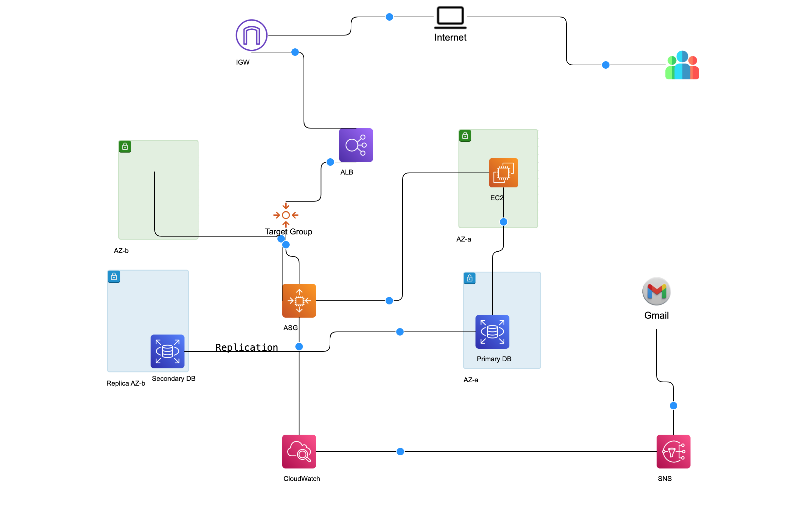

This diagram represents a **highly available, scalable, and secure AWS architecture** designed for deploying a pharmacy web application.

 🌐 Networking Layer

The infrastructure is deployed inside a custom **Virtual Private Cloud (VPC)** that includes both public and private subnets distributed across multiple Availability Zones.

* Public subnets host internet-facing components
* Private subnets isolate sensitive resources like the database
* An **Internet Gateway (IGW)** enables external communication

 ⚖️ Traffic Management (ALB)

User traffic flows as follows:

**Users → Internet → ALB → Target Group → EC2 Instances**

* The **Application Load Balancer (ALB)** distributes incoming traffic
* Requests are routed only to **healthy EC2 instances**
* Ensures high availability and fault tolerance

 🖥️ Compute Layer (EC2 + Auto Scaling)

* EC2 instances are deployed across **multiple AZs**
* Managed by an **Auto Scaling Group (ASG)**
* Automatically scales based on demand

✔ Ensures:

* Load distribution
* Fault tolerance
* High availability

🗄️ Database Layer (RDS - Private Subnet)

* Database is deployed in a **private subnet**
* Includes:

  * **Primary DB** (write operations)
  * **Replica DB** (read/failover)

✔ Ensures:

* Data security (no public access)
* High availability
* Disaster recovery support

 🔐 Identity & Access Management (IAM)

AWS IAM is used to manage secure access to cloud resources.

- Role-based access control is implemented for services
- Permissions are assigned using IAM policies
- The architecture follows the principle of least privilege to enhance security
  
 🔐 Security Layer

* Only ALB and EC2 are exposed publicly
* Database is fully isolated
* Controlled using:
  * Security Groups
  * Network ACLs

 📊 Monitoring & Alerts

* **CloudWatch** monitors system performance
* **Alarms** trigger on high CPU usage
* **SNS** sends email notifications to admins

🔁 High Availability & Scalability

This architecture provides:

* Multi-AZ deployment
* Automatic scaling
* Load-balanced traffic
* Fault-tolerant infrastructure

💡 Key Outcome

This setup demonstrates a **production-ready cloud architecture** following AWS best practices for scalability, security, and reliability.

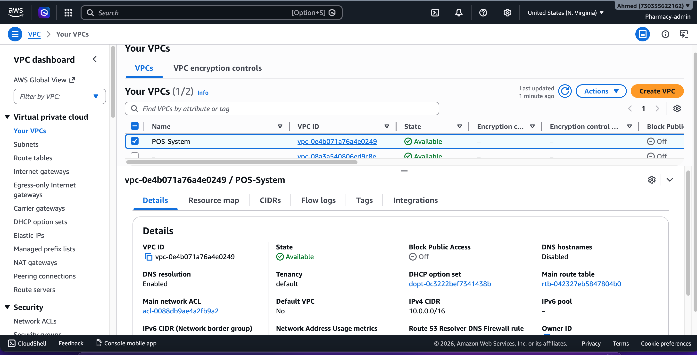

🔹 VPC Name: pharmacy-system  
🔹 CIDR Block: 10.0.0.0/16  

This Virtual Private Cloud (VPC) serves as the foundational network for the pharmacy system infrastructure. It provides a logically isolated environment where all AWS resources are securely deployed.

The VPC is designed to support both public and private subnets across multiple Availability Zones, enabling high availability and scalability.

✔ Isolated and secure network environment  
✔ Flexible IP range for future expansion  
✔ Full control over routing, access, and connectivity  

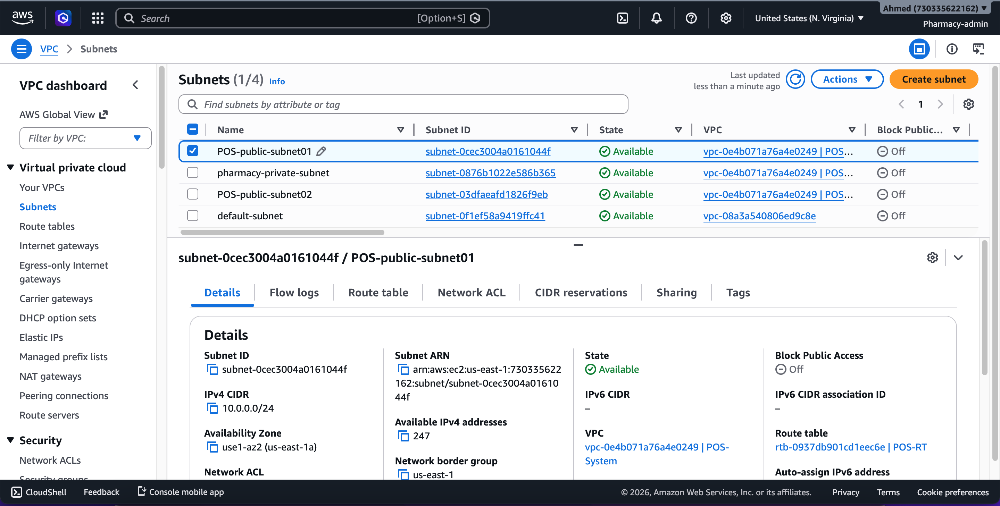

🔹 Public Subnets (AZ-a, AZ-b)  
🔹 Private Subnet (Database Layer)  

The architecture uses a combination of public and private subnets distributed across multiple Availability Zones to ensure high availability and proper resource isolation.

Public subnets host internet-facing resources such as the Load Balancer and EC2 instances, while the private subnet is dedicated to the database layer for enhanced security.

✔ Multi-AZ deployment for high availability  
✔ Separation between public and private resources  
✔ Improved security by isolating sensitive components  

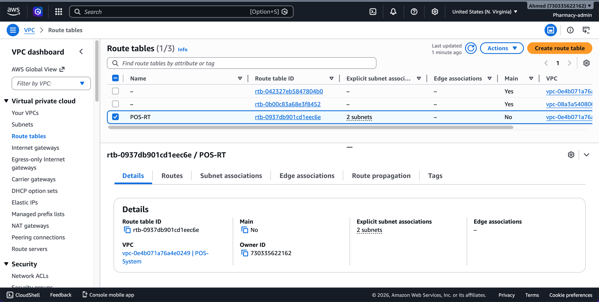

🔹 Attached to: pharmacy-system VPC  

The Internet Gateway (IGW) enables communication between resources in the public subnets and the internet.

It allows EC2 instances and the Application Load Balancer to receive incoming traffic and send responses to users.

✔ Enables public internet access  
✔ Required for web applications and external connectivity  
✔ Works with route tables to direct traffic (0.0.0.0/0)  

🔹 Public Route Table → linked to public subnets  
🔹 Private Route Table → linked to private subnet  

Route tables are used to control how traffic flows within the VPC.

The public route table includes a route to the Internet Gateway (0.0.0.0/0), allowing internet access for public resources.  
The private route table restricts direct internet access, ensuring that sensitive resources like the database remain isolated.

✔ Controls traffic flow between subnets  
✔ Enables internet access only for public resources  
✔ Enhances security by isolating private components  
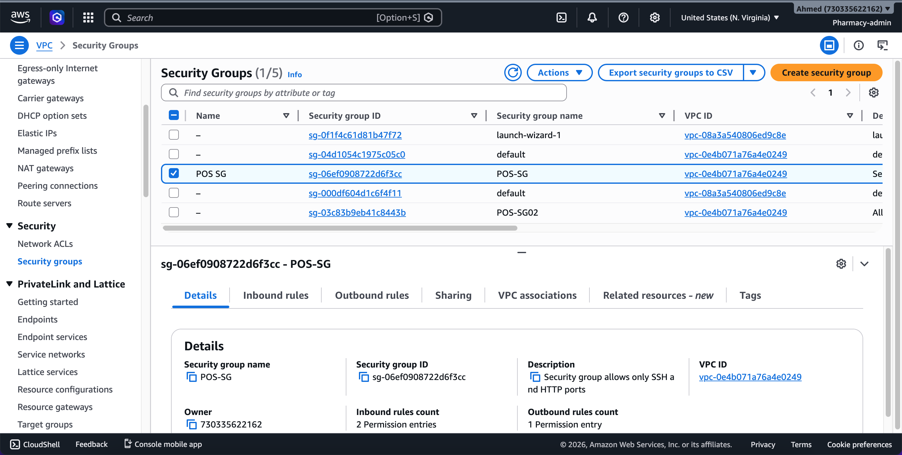

🔹 Applied to: EC2 instances & Load Balancer  
🔹 Inbound Rules:  
- SSH (22) → restricted access  
- HTTP (80) → open to internet  

Security Groups act as virtual firewalls that control inbound and outbound traffic for resources within the VPC.

They ensure that only authorized traffic is allowed to reach the EC2 instances and application components, while restricting unnecessary access.

✔ Instance-level security control  
✔ Allows only required ports (SSH & HTTP)  
✔ Protects infrastructure from unauthorized access  
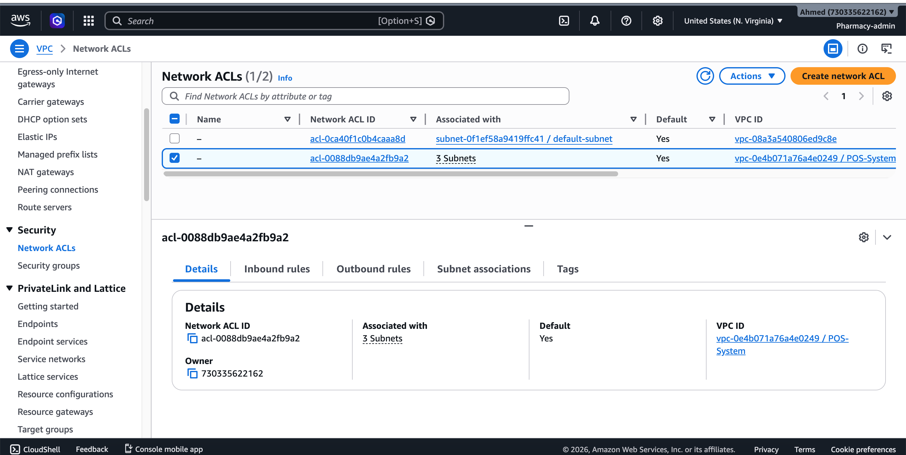

🔹 Applied at: Subnet level  
🔹 Rules: Allow HTTP, SSH, and ephemeral ports  

Network ACLs provide an additional layer of security at the subnet level, controlling inbound and outbound traffic for all resources within the subnet.

They work alongside Security Groups to enforce traffic rules, allowing or denying specific IP ranges and ports.

✔ Subnet-level security control  
✔ Stateless filtering (rules must be defined for inbound & outbound)  
✔ Enhances overall network security  

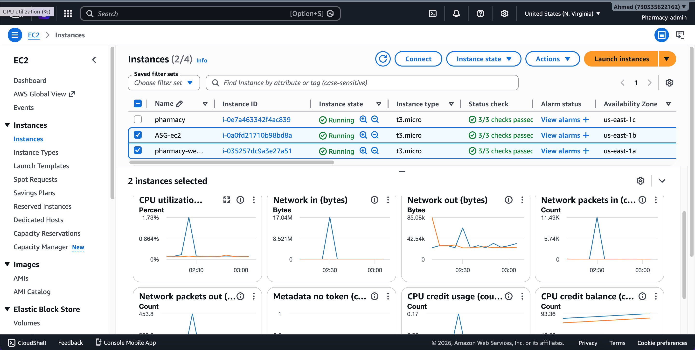

🔹 Instance Type: t3.micro  
🔹 Deployed in: Public Subnets (Multi-AZ)  

EC2 instances are used to host the pharmacy web application. They are deployed across multiple Availability Zones to ensure high availability and fault tolerance.

These instances run the application (NGINX / web app) and handle incoming requests from the Load Balancer.

✔ Hosts the application layer  
✔ Multi-AZ deployment for reliability  
✔ Integrated with Auto Scaling for dynamic capacity  

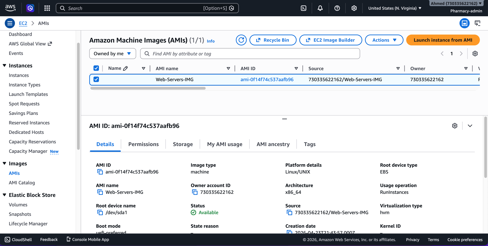

🔹 Custom AMI created from configured EC2 instance  

The AMI is created after setting up the EC2 instance with the required application and configurations (e.g., NGINX or web app).

It serves as a reusable template for launching new instances with the same setup, ensuring consistency across the environment.

✔ Enables fast and consistent deployments  
✔ Used by Launch Template and Auto Scaling Group  
✔ Reduces manual configuration effort  

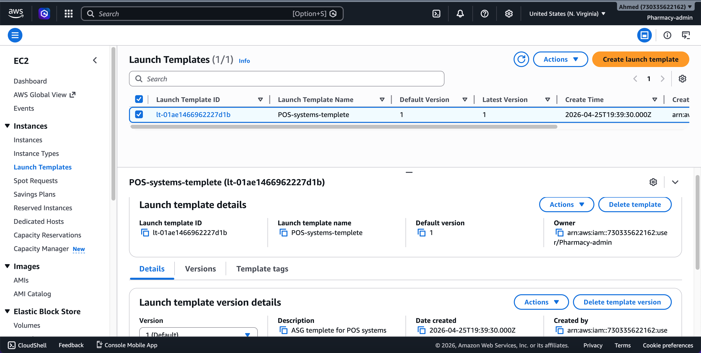

🔹 Based on: Custom AMI  
🔹 Instance Type: t3.micro  

The Launch Template defines the configuration used to launch EC2 instances automatically. It includes details such as the AMI, instance type, security groups, and key settings.

It ensures that all instances created by the Auto Scaling Group are consistent and properly configured.

✔ Standardized instance configuration  
✔ Integrated with Auto Scaling Group  
✔ Enables automated and scalable deployments  

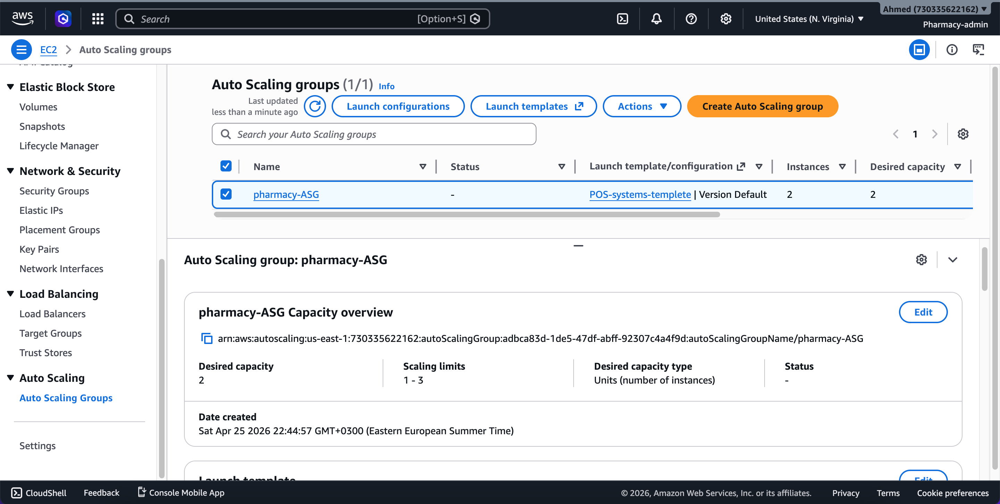

🔹 Min: 1 | Desired: 2 | Max: 3  
🔹 Multi-AZ deployment  

The Auto Scaling Group automatically manages the number of EC2 instances based on demand. It ensures that the application remains available by replacing unhealthy instances and scaling capacity when needed.

Instances are distributed across multiple Availability Zones to improve fault tolerance.

✔ Automatic scaling based on load  
✔ Maintains application availability  
✔ Replaces unhealthy instances automatically  

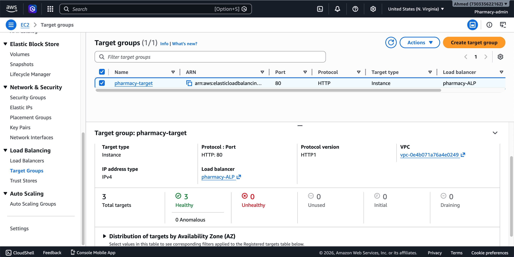

🔹 Linked to: Application Load Balancer  
🔹 Targets: EC2 instances  

The Target Group is used by the Application Load Balancer to route incoming requests to the registered EC2 instances.

It performs health checks to ensure that only healthy instances receive traffic, improving reliability and availability.

✔ Routes traffic to EC2 instances  
✔ Performs health checks automatically  
✔ Ensures only healthy instances serve requests  

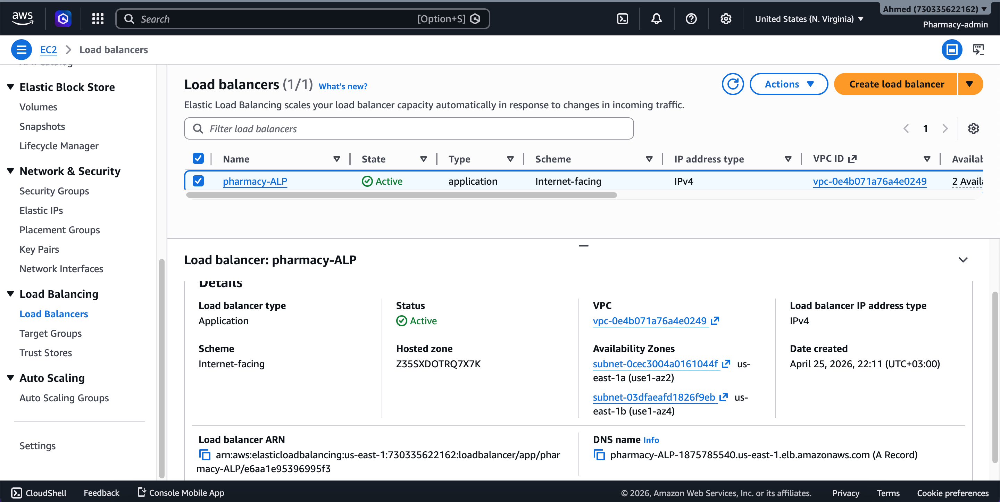

🔹 Internet-facing Load Balancer  
🔹 Connected to Target Group  

The Application Load Balancer distributes incoming HTTP traffic across multiple EC2 instances to ensure high availability and fault tolerance.

It routes requests to the Target Group and continuously checks the health of instances to send traffic only to healthy ones.

✔ Distributes traffic efficiently across instances  
✔ Improves availability and fault tolerance  
✔ Acts as the entry point for user requests  

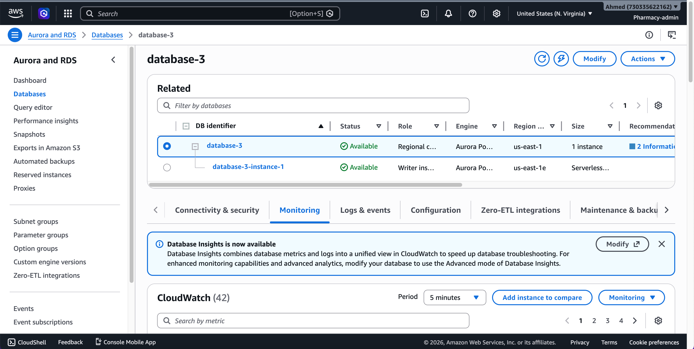

🔹 Engine: Aurora PostgreSQL  
🔹 Deployment: Private Subnet  

Amazon RDS is used to host the database layer for the pharmacy system. It is deployed داخل private subnet to ensure it is not publicly accessible, enhancing security.

The setup includes a primary database for write operations and a replica for high availability and failover support.

✔ Secure database in private network  
✔ High availability with replication  
✔ Managed service (automatic backups & maintenance)  

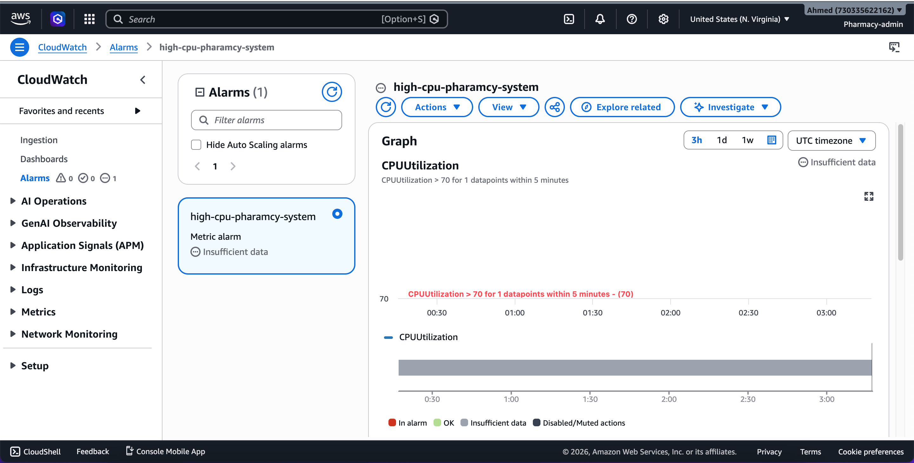

🔹 Monitoring: EC2 & system metrics  
🔹 Metric: CPU Utilization  

Amazon CloudWatch is used to monitor the performance and health of the infrastructure in real time.

It tracks key metrics such as CPU utilization and helps detect unusual behavior or high load on EC2 instances.

✔ Real-time performance monitoring  
✔ Tracks system metrics (CPU, usage, etc.)  
✔ Integrated with alarms for automated actions  

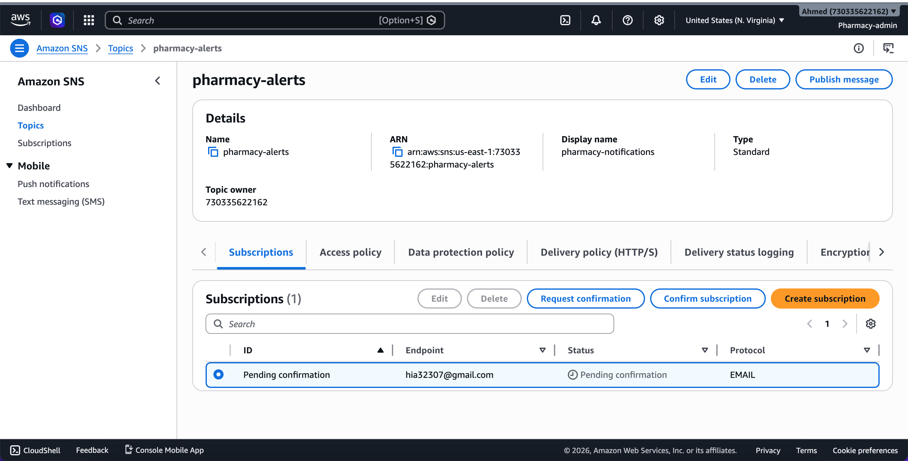

🔹 Used for: Alert notifications  
🔹 Integrated with: CloudWatch Alarms  

Amazon SNS is used to send real-time notifications when specific events occur, such as high CPU usage detected by CloudWatch alarms.

It delivers alerts (e.g., via email) to keep administrators informed and enable quick response to issues.

✔ Real-time alerting system  
✔ Integrated with CloudWatch alarms  
✔ Improves monitoring and incident response  

Categories
  
🌐 Networking
- VPC  
- Subnets (Public & Private)  
- Internet Gateway  
- Route Tables  
- Network ACL  

🔐 Security
- Security Groups  
- IAM (Role-based access & least privilege)  

🖥️ Compute
- EC2 Instances  
- AMI (Amazon Machine Image)  
- Launch Template  
- Auto Scaling Group  

⚖️ Load Balancing
- Application Load Balancer (ALB)  
- Target Group  

🗄️ Database
- Amazon RDS (Aurora PostgreSQL)  

📊 Monitoring
- Amazon CloudWatch  

🔔 Notifications
- Amazon SNS
  

  🚀 This project was built using official AWS documentation and best practices.

🌐 AWS Documentation
- https://docs.aws.amazon.com/vpc/
- https://docs.aws.amazon.com/ec2/
- https://docs.aws.amazon.com/autoscaling/
- https://docs.aws.amazon.com/elasticloadbalancing/
- https://docs.aws.amazon.com/rds/
- https://docs.aws.amazon.com/cloudwatch/
- https://docs.aws.amazon.com/sns/

📖 Learning References
- AWS Well-Architected Framework  
- AWS Free Tier Documentation  

🛠️ Tools Used
- AWS Management Console  
- Linux (Ubuntu)  
- NGINX (for web server setup)

💡 This project follows AWS best practices for building scalable, secure, and highly available cloud architectures.
